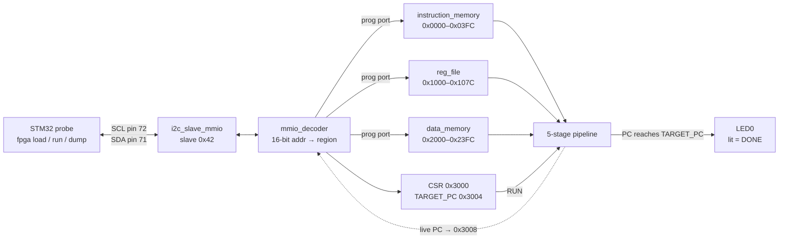
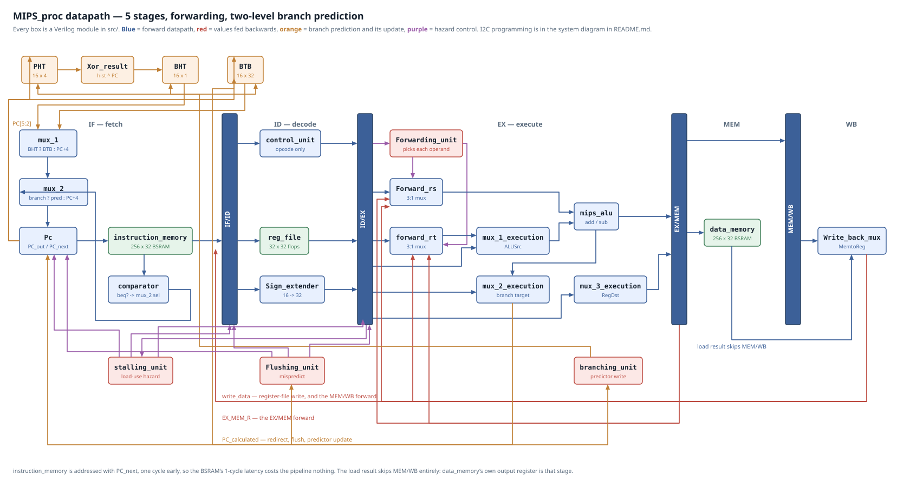

# MIPS_proc on the Tang Nano 20K

This directory is the **Sipeed Tang Nano 20K** port of the MIPS core in
[`../MIPS_proc/`](../MIPS_proc/README.md). The RTL is the same 5-stage pipelined MIPS-style
processor with forwarding, load-use stalling and dynamic branch prediction, wrapped in an I2C
slave — but it builds through the fully open toolchain (yosys → nextpnr-himbaechel →
gowin_pack → openFPGALoader), driven by the OpenFPGA Deck VS Code extension, instead of Vivado.

The STM32 probe loads a program over I2C, starts the core, and reads memory and registers back.
Nothing about that protocol changed; only the board, the pins and the toolchain did.

| Path | Contents |
|---|---|
| `src/` | All 32 Verilog modules. Top module is `top` in `top_1_2.v` |
| `constraints/top.cst` | Gowin physical constraints for the Tang Nano 20K |
| `constraints/const.xdc` | The ZedBoard constraints, kept for reference — **not** used by this build |
| `docs/datapath.drawio.svg` | The datapath diagram below, editable in draw.io |
| `docs/gen_datapath.py` | Regenerates that diagram from its box/edge description |
| `fpga.yaml` | OpenFPGA Deck project: board, top module, source list |

**This README covers what is specific to this port**: the module-by-module reference, the
diagrams, and the board bring-up. For everything shared with the ZedBoard build — the
instruction set, the memory map, the I2C wire protocol, the run lifecycle, the block-RAM
conversion and the ASIC-macro notes — see [`../MIPS_proc/README.md`](../MIPS_proc/README.md).
It is the single source of truth for those, so they are deliberately not repeated here.

---

## How a program gets in and a result comes out



Every memory has a second port reserved for the probe, so the MCU can read back anything it
wrote — plus the live PC — without disturbing the core. `RUN=0` freezes every pipeline
register, which is what makes loading safe.

---

## Datapath



The file is a `.drawio.svg`: GitHub renders it as an image, and double-clicking it in VS Code
opens it in the draw.io editor (the `hediet.vscode-drawio` extension). If you prefer to change
it as code, edit the box and edge tables in `docs/gen_datapath.py` and re-run it:

```bash
python3 docs/gen_datapath.py > docs/datapath.drawio.svg
```

Every wire is routed through a vertical gutter or horizontal lane that no block occupies, and
box widths are computed from their own text. The script checks the routing itself: if a box
moves so that some arrow would cut through it, the run fails and names the offending segment
instead of quietly producing a cluttered picture.

The I2C programming and readback path is deliberately left out of this picture — the system
diagram above already shows it, and the row it would take is spent on the hazard control
instead.

Two details in that picture are worth stating outright, because both look like mistakes until
you know why they are there:

- **`instruction_memory` is addressed with `PC_next`, not `PC_out`.** The BSRAM registers its
  address, so data arrives on the *next* edge. Feeding it the value the PC is about to take
  makes the instruction appear exactly when the old combinational read produced it, and the
  one-cycle RAM latency costs the pipeline nothing.
- **The load result skips `M_WB_Register`.** `data_memory.rd_data` goes straight to
  `Write_back_mux`, because the RAM's own output register *is* that pipeline stage.
  `M_WB_Register` no longer carries an `Rd_data` field at all.

---

## Module reference

32 modules, one per file. Names below are module names; the filenames carry version suffixes
(`ALU_2_1_2.v`, `EX_MEM_2_1_2.v`) that do not always match, which is inherited from the Vivado
project and left alone deliberately.

### System wrapper

| Module | File | What it does |
|---|---|---|
| `top` | `top_1_2.v` | Instantiates everything and owns the run/drain state machine: `run_req` → `target_reached` → `drain_count` → `done`. Derives `pipeline_freeze`, `stop_fetch` and `pc_hold`, and drives the LED. |
| `i2c_slave_mmio` | `i2c_slave_mmio_1_2.v` | I2C slave at address `0x42`. 3-stage SCL/SDA synchronisers, START/STOP detection, a byte state machine, open-drain SDA (`sda_oe` pulls low, otherwise `1'bz`), and a repeated-START read path that shifts a snapshotted 32-bit word out MSB first. |
| `mmio_decoder` | `mmio_decoder_1_2.v` | Splits the 16-bit address space into IMEM / regfile / DMEM write enables, holds the CSR and TARGET_PC registers, and combinationally muxes the readback value. Unmapped addresses read `0xDEADBEEF`. |
| `sram_1rw1r` | `sram_1rw1r_1_2.v` | The 256×32 synchronous RAM both memories instantiate: one read/write port plus one read-only port. Synchronous reads and no reset, deliberately — either one stops block-RAM inference. |

### IF — instruction fetch

| Module | File | What it does |
|---|---|---|
| `Pc` | `Pc_1_2.v` | The program counter. Splits into a combinational `PC_next` and one flop, so the RAM can be addressed a cycle early. Priority: `rst` > `hold` > `PC_flush` > `PC_stall` > predicted `PC_in`. |
| `instruction_memory` | `instruction_memory_1_2.v` | 256×32 IMEM on `sram_1rw1r`. Fetch port reads `PC_next[9:2]`; the second port serves I2C writes and readback. Fetch is disabled during a programming write so both ports never hit one address. |
| `comparator` | `comparator_2_1_2.v` | Decodes whether the *fetched* word is a `beq` (opcode `000101`). **Note the inverted sense:** it outputs `0` for a branch and `1` otherwise, because it is a mux select line, not a comparison result. |
| `PHT` | `PHT_2_1_2.v` | Pattern history table: 16 × 4-bit shift registers of recent outcomes, indexed by `PC_out[5:2]`. |
| `Xor_result` | `Xor_result_1_1_2.v` | Gshare-style index: `PHT_rd_data ^ PC[5:2]`, giving the BHT read address. |
| `BHT` | `BHT_3_1_2.v` | 16 × 1-bit taken/not-taken predictions, indexed by that XOR. |
| `BTB` | `BTB_3_1_2.v` | 16 × 32-bit branch target buffer, indexed by `PC_out[5:2]`. |
| `mux_1` | `mux_1_1_1_2.v` | `BHT_rd_data ? BTB_rd_data : PC_out + 4` — the prediction, assuming this is a branch. |
| `mux_2` | `mux_2_1_1_2.v` | Final next PC: reset → 0, branch (`comparator == 0`) → the prediction, otherwise `PC_out + 4`. |

### IF/ID

| Module | File | What it does |
|---|---|---|
| `IF_ID_register` | `IF_ID_register_1_2.v` | Carries the instruction, the `comparator` bit, the PC and the BHT index. Priority: `rst` > `freeze` > `stall` > **`stop_fetch`** > `flush` > normal. That `stop_fetch` branch injects the `0xFC000000` NOP and is the entire mechanism behind the TARGET_PC halt — the pipeline drains because no new instruction can enter. |

### ID — decode

| Module | File | What it does |
|---|---|---|
| `reg_file` | `reg_file_1_2.v` | 32 × 32 flip-flops, not RAM. Two asynchronous read ports, a write-before-read bypass so a WB in the same cycle is seen by ID, and a third asynchronous port for I2C readback. `r0` is never written. Reset loads `RF[i] = i`. |
| `control_unit` | `control_unit_2_1_2.v` | Decodes the 6-bit opcode *only* — `funct` and `shamt` are ignored — into `{EX[3:0], M[1:0], WB[1:0]}`, i.e. `{RegDst, ALUOp, ALUSrc}`, `{MemRead, MemWrite}`, `{RegWrite, MemtoReg}`. Unknown opcodes produce all zeros, so they do nothing. |
| `Sign_extender` | `Sign_extender_1_1_2.v` | 16-bit immediate → 32 bits. |

### ID/EX

| Module | File | What it does |
|---|---|---|
| `ID_EX_register` | `ID_EX_register_2_1_2.v` | Carries the control bundles, `rs`/`rt`/`rd_maybe`, both register reads, the immediate, the PC and the BHT index. Honours `freeze`, `stall` and `flush`. |

### EX — execute

| Module | File | What it does |
|---|---|---|
| `Forwarding_unit` | `Forwarding_unit_2_1_2.v` | Compares `ID_EX_rs`/`ID_EX_rt` against `EX_MEM_rd` and `MEM_WB_rd`. Emits `10` for an EX/MEM forward, `11` for MEM/WB, `00` for the register file. EX/MEM wins when both match, which is what makes the newest value the one that is used. |
| `Forward_rs` | `Forward_rs_2_1_2.v` | 3:1 mux selecting `operand_1` from `D_1`, `EX_MEM_R` or the WB write data. |
| `forward_rt` | `forward_rt_2_1_2.v` | The same for `rt_f`, which feeds both the ALU-source mux and the store data path. |
| `mux_1_execution` | `mux_1_execution_1_1_2.v` | ALUSrc: forwarded `rt` vs the sign-extended immediate → `operand_2`. |
| `mips_alu` | `ALU_2_1_2.v` | Add (`ALUOp = 00`) and subtract (`10`), plus the `zero` flag. **Named `mips_alu`, not `ALU`** — see [Module naming](#module-naming-alu--mips_alu) below. `zero` means "the result was zero", which for `beq`'s subtract is exactly "the operands were equal". |
| `mux_2_execution` | `mux_2_execution_2_1_2.v` | Branch target: `zero ? (PC+4) + (imm << 2) : PC+4` → `PC_calculated`. |
| `mux_3_execution` | `mux_3_execution_1_1_2.v` | RegDst: writes go to `rd_maybe` (R-type) or `rt` (I-type). |
| `stalling_unit` | `stalling_unit_1_1_2.v` | Load-use hazard: if an `lw` in EX writes a register ID is reading, hold `PC` and `IF/ID` and bubble `ID/EX`. The `rt` comparison is skipped for `addi` and `lw` in decode, because those only *write* `rt`, they do not read it. |
| `Flushing_unit` | `Flushing_unit_3_1_2.v` | A branch in EX whose actual target differs from the fetched-next PC raises all three flushes and redirects the PC. |
| `branching_unit` | `branching_unit_3_1_2.v` | Predictor write enables. The PHT is updated on every branch; the BHT and BTB only when the prediction was actually wrong. |

### EX/MEM, MEM, MEM/WB, WB

| Module | File | What it does |
|---|---|---|
| `EX_MEM_Register` | `EX_MEM_2_1_2.v` | Carries `M`/`WB` control, the ALU result, the forwarded store data and the destination register. |
| `data_memory` | `data_memory_1_2.v` | 256×32 DMEM on `sram_1rw1r`, word-indexed. On reset a 256-cycle counter walks the array writing zero, because a block RAM cannot be bulk-cleared — about 9.5 µs at 27 MHz, long before the MCU can set RUN. Port-0 priority is clear walk > I2C write > CPU. |
| `M_WB_Register` | `M_WB_Register_1_1_2.v` | Carries `WB` control, the ALU result and the destination register — and **not** the load data, which now comes straight out of the RAM's output register. |
| `Write_back_mux` | `Write_back_mux_1_1_2.v` | MemtoReg: the load result or the ALU result becomes the register write data. |

---

## Board bring-up

### Pins

All five top-level ports, from `constraints/top.cst`:

| Port | Pin | Attributes | Notes |
|---|---|---|---|
| `clk` | 4 | `LVCMOS33 PULL_MODE=UP` | 27 MHz on-board oscillator |
| `rst` | 88 | `LVCMOS33 PULL_MODE=NONE` | Button S1, **active-high** |
| `led` | 15 | `LVCMOS33 PULL_MODE=UP DRIVE=8` | On-board LED0, **active-low** |
| `scl` | 72 | `LVCMOS33 PULL_MODE=UP` | Header J5 (IOT40A) |
| `sda` | 71 | `LVCMOS33 PULL_MODE=UP` | Header J5 (IOT40B), bidirectional |

Pins 72 and 71 are adjacent on J5, right next to that header's 3V3/GND pair, and no on-board
peripheral claims either. They were picked over the other free pins for that reason; pins
52/53 were specifically avoided because they are the HDMI DDC I2C lines and would put the
HDMI sink on the same bus.

**Buttons on this board are active-high**: the switch feeds +3V3 through ~330 R and an
external ~1 K pull-down holds the pin low when released, so no internal pull is wanted. `rst`
is active-high in the RTL too, so it wires straight through with no inverter. (This also fits
pin 88 being MODE0, which needs a defined low at configuration time.)

**The LEDs are active-low** — drive 0 to light. `top_1_2.v` therefore keeps the internal
`led_r` in the ZedBoard sense (1 = done) and drives the port inverted, so a lit LED0 still
means DONE.

### Probe wiring

STM32 **PB6 → pin 72** (SCL), **PB7 → pin 71** (SDA), and **GND ↔ GND**. Both sides are
3.3 V. `PULL_MODE=UP` in the `.cst` is the Gowin weak (~50 kΩ) pull-up — a safety net for a
floating bus, **not** a substitute for proper external **4.7 kΩ pull-ups to 3V3**, which this
link still needs.

### Building

Through the OpenFPGA Deck extension (command palette): *Synthesize*, *Place & Route*,
*Program*. Program to **SRAM** first — it is volatile, so a power cycle undoes a bad
bitstream — and only write flash once the board behaves.

The equivalent by hand, if you want to drive the toolchain directly:

```bash
yosys -p 'read_verilog src/*.v; synth_gowin -top top -json build/top.json'
nextpnr-himbaechel --device 'GW2AR-LV18QN88C8/I7' \
    --vopt family=GW2A-18C --vopt cst=constraints/top.cst --freq 27 \
    --json build/top.json --write build/top.pnr.json --report build/pnr.json
gowin_pack -d GW2A-18C -o build/top.fs build/top.pnr.json
openFPGALoader -b tangnano20k build/top.fs
```

### Measured resource use

From an actual place-and-route run of this design on the GW2AR-18C:

| Resource | Used | Available | |
|---|---|---|---|
| LUT4 | 6713 | 20736 | 32% |
| MUX2_LUT5/6/7/8 | 1644 | — | fabric mux fabric |
| DFF | 2228 | 15552 | 14% |
| BSRAM | 4 | 46 | 8% |
| ALU (carry chain) | 220 | 15552 | 1% |
| IOB | 4 + 1 clock | 384 | |
| BUFG | 1 | 24 | the global clock buffer for `clk` |

IMEM becomes 2 × `DPX9B` (true dual-port) and DMEM 2 × `SDPX9B` (semi dual-port); Gowin's
dual-port BSRAM caps at 16 bits per port, so a 32-bit port takes two. `reg_file` and the
predictor tables stay in flip-flops, which is intended — see the ZedBoard README.

### Clock rate

**The core runs directly off the 27 MHz oscillator. There is no PLL, and none is needed.**

Place and route reports **Fmax = 48.3 MHz**, which passes 27 MHz with a wide margin. The
critical path is in `Forwarding_unit`, feeding the EX-stage operand muxes.

100 MHz is not reachable on this fabric: 48 MHz is the ceiling, and lifting it would mean
re-pipelining a critical path in RTL that is already debugged and working. It would also buy
nothing here — the core is fed by an STM32 over a 100 kHz I2C link and halts on TARGET_PC, so
throughput is not what this build is for. If you ever do want more, the honest options are an
`rPLL` up to ~45 MHz, or splitting the forwarding comparison across a cycle; in that order.

---

## Differences from the ZedBoard build

| | ZedBoard | Tang Nano 20K |
|---|---|---|
| Device | `xc7z020clg484-1` | `GW2AR-LV18QN88C8/I7` |
| Toolchain | Vivado | yosys + nextpnr-himbaechel + gowin_pack |
| Clock | 100 MHz osc, constrained at 50 MHz | 27 MHz osc, runs at 27 MHz, Fmax 48.3 MHz |
| `rst` | SW0 (F22), active-high | S1 (pin 88), active-high |
| `led` | LD0 (T22), active-**high** | LED0 (pin 15), active-**low**, driven inverted |
| `scl` / `sda` | JA1 (Y11) / JA2 (AA11) | pin 72 / pin 71 |
| ALU module name | `ALU` | `mips_alu` |
| Constraints | `constraints/const.xdc` | `constraints/top.cst` |

### Module naming: `ALU` → `mips_alu`

Yosys's Gowin cell library (`share/yosys/gowin/cells_sim.v`) defines its **own** `ALU`
primitive — the fabric carry-chain cell. A design module of the same name collides with it and
synthesis stops with `Re-definition of module '\ALU'`. Vivado has no such primitive, which is
why the ZedBoard build never hit this.

The module was therefore renamed to `mips_alu` in `ALU_2_1_2.v`, with its single instantiation
in `top_1_2.v` updated to match. The file name is unchanged. **If you copy these sources back
into the Vivado project, that rename comes with them** — it is harmless there, but the two
trees will otherwise disagree. It is the only module in this design whose name collides with
the Gowin library.
